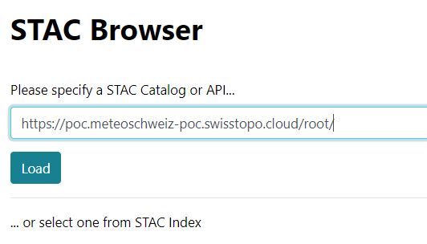
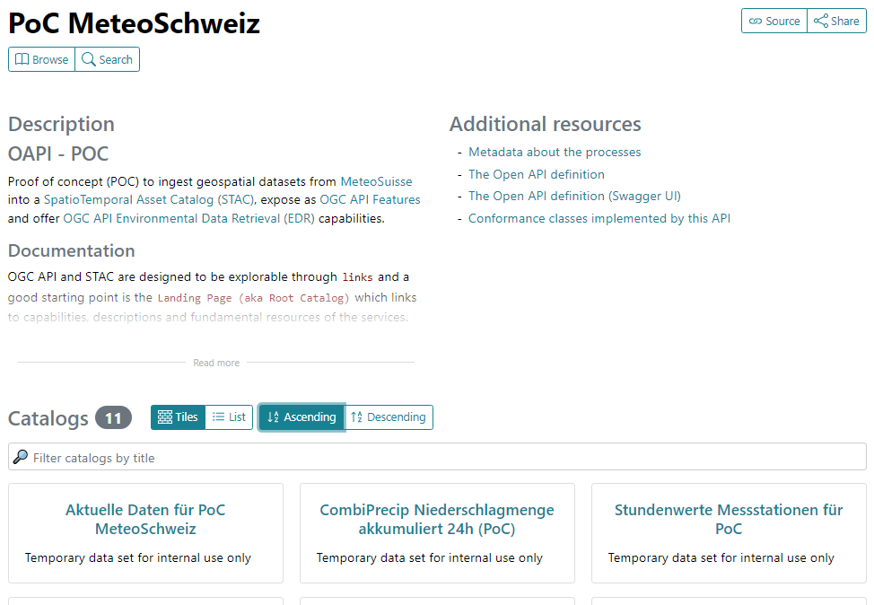
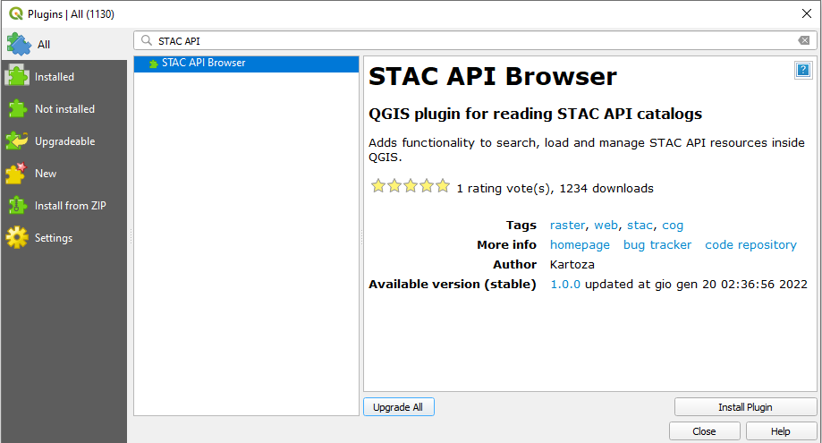
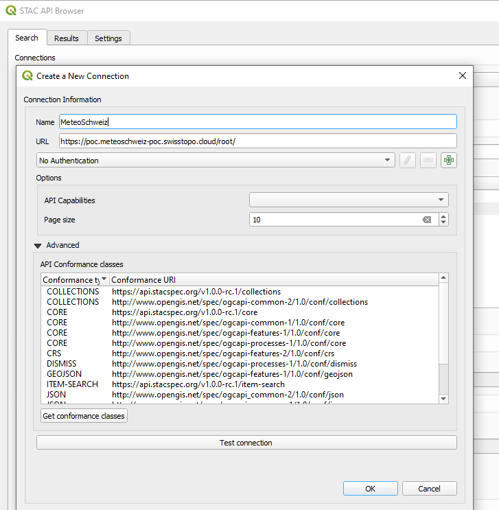
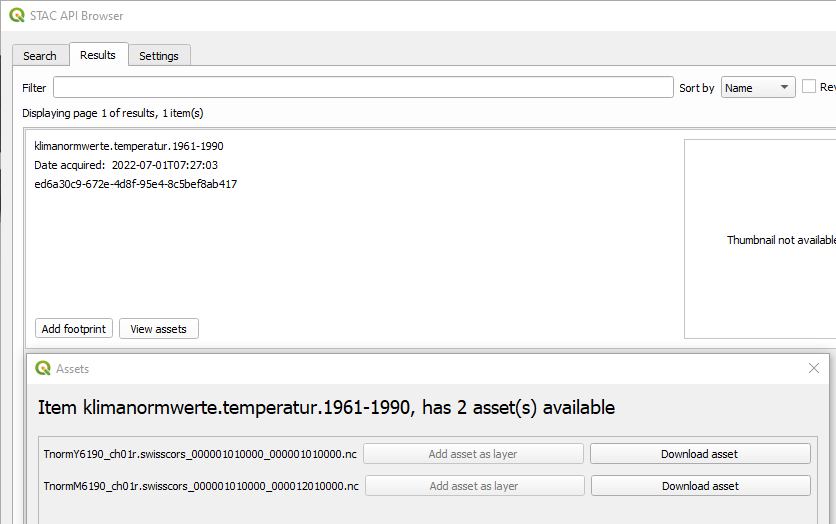
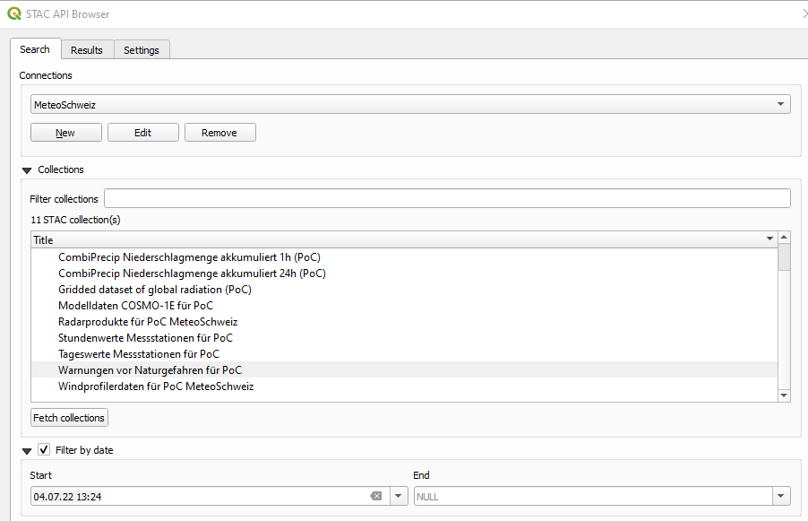
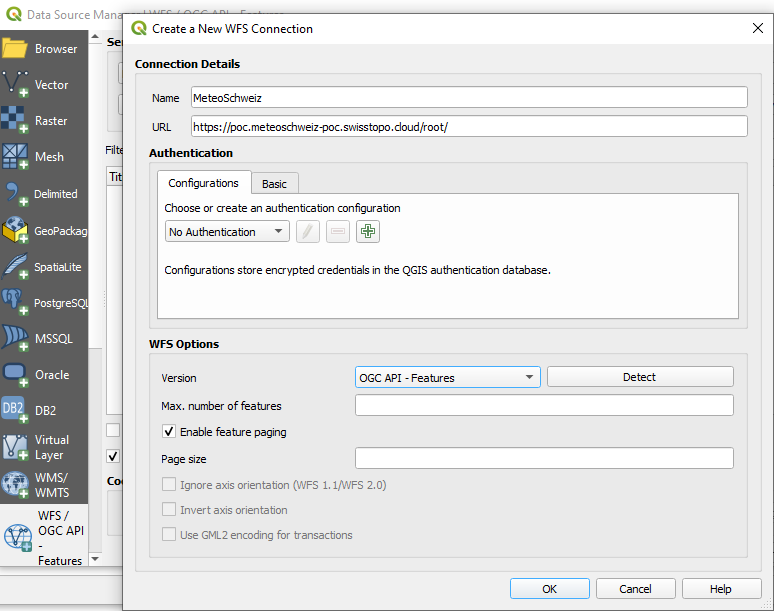
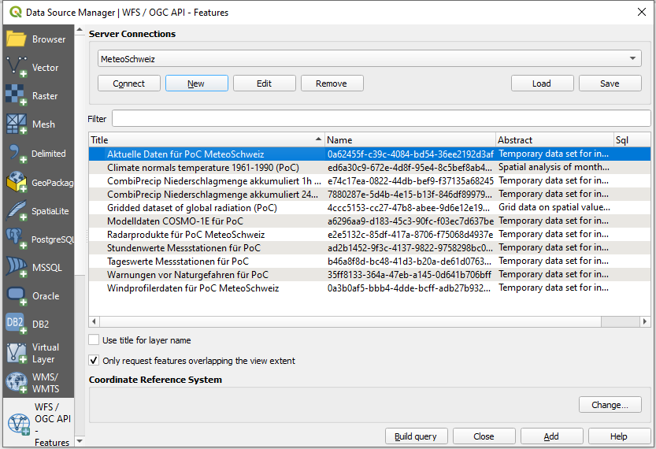
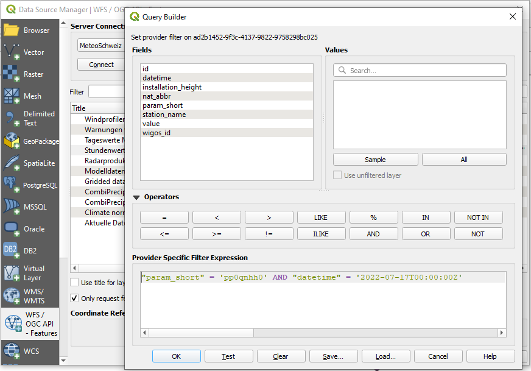

# STAC API and OGC API - Features - Part 1: Core

This API is an implementation of both the [STAC API](https://github.com/radiantearth/stac-api-spec) and the [OGC API - Features - Part 1: Core](https://ogcapi.ogc.org/features/) (OAFeat). The STAC API and OAFeat have a slightly different data model, which is briefly discussed below.

The STAC API is a “**dataset based**” download service providing access to packaged geospatial data and related metadata. The data model is based on the following main concepts:

- Collection: a `collection` is a set of metadata about a geospatial dataset, like its name, description, spatial and temporal extent, etc. Individual records within a collection are called `items`
- Item: an `item` represents an atomic collection of inseparable data and metadata. A STAC `item` is a GeoJSON Feature and can be easily read by any modern GIS or geospatial library, and it describes a SpatioTemporal Asset. This means that the GeoJSON is not the "actual" thing, but instead references files and serves as an index to an `asset`
- Asset: an `asset` is any file containing the actual data.

OAFeat is a "**features based**" service providing access to single objects (`features`) of a dataset. In OAFeat there is no concept of `asset` and the `item` is the actual data.

To summarize, the STAC API is aimed at providing access to the complete dataset, while OAFeat is aimed at providing access to single features of a dataset.

## API endpoints

The API provides the following endpoints:

| Endpoint                                        | Returns                                                 | Description                                                                         |
| ----------------------------------------------- | ------------------------------------------------------- | ----------------------------------------------------------------------------------- |
| [/](https://poc.meteoschweiz-poc.swisstopo.cloud/root/)                                             | JSON                                                    | Landing page                                                                        |
| [/conformance](https://poc.meteoschweiz-poc.swisstopo.cloud/root/conformance)                                  | JSON                                                    | Info about standards to which the API conforms                                      |
| [/collections](https://poc.meteoschweiz-poc.swisstopo.cloud/root/collections)                                  | JSON                                                    | Object containing an array of Collection objects in the Catalog, and Link relations |
| `/collections/{collectionId}`                   | Collection                                              | Returns single Collection JSON                                                      |
| `/collections/{collectionId}/items`             | ItemCollection                                          | GeoJSON FeatureCollection-conformant entity of Item objects in collection           |
| `/collections/{collectionId}/items/{featureId}` | Item                                                    | Returns single Item (GeoJSON Feature)                                               |
| [/search](https://poc.meteoschweiz-poc.swisstopo.cloud/root/search)                                       | Item Collection                                         | STAC search endpoint                                                                |

The API documentation is available here:

|Endpoint|Description|
|--------|-----------|
|[/api](https://poc.meteoschweiz-poc.swisstopo.cloud/root/api)|The Open API definition|
|[/swagger](https://poc.meteoschweiz-poc.swisstopo.cloud/root/swagger)|The Swagger UI|

## Default limit and pagination

The number of items returned as a result to a query (`/collections/{collectionId}/items` and `/search` endpoints) is limited to 100. In case the number of matched items is greater than 100, the API implements a pagination mechanism and provides two links `rel: "next"` and `rel: "prev"` to allow you to go through all matched items.
The following [query](https://poc.meteoschweiz-poc.swisstopo.cloud/root/collections/ad2b1452-9f3c-4137-9822-9758298bc025/items?limit=100), for example, matches 394092 (see property `numberMatched`) items but only returns 100 of them (see property `numberReturned`). The link with `rel: "next"` returns the next 100 items and so on. The link with `rel: "prev"` returns the previous 100 items. 

## Available datasets

The API provides currently the following datasets (collections):

>**Note**
>The collections [Aktuelle Daten Temperatur](https://radiantearth.github.io/stac-browser/#/external/poc.meteoschweiz-poc.swisstopo.cloud/root/collections/0a62455f-c39c-4084-bd54-36ee2192d3af) and [Stundenwerte Messstationen](https://radiantearth.github.io/stac-browser/#/external/poc.meteoschweiz-poc.swisstopo.cloud/root/collections/ad2b1452-9f3c-4137-9822-9758298bc025) have been implemented as STAC and as OAFeat resources. The STAC assets (the complete datasets) are available directly at collection level. The assets at item level do not link to packaged files but to the API call to the item itself. 

- [Aktuelle Daten Temperatur](https://radiantearth.github.io/stac-browser/#/external/poc.meteoschweiz-poc.swisstopo.cloud/root/collections/0a62455f-c39c-4084-bd54-36ee2192d3af) - ID: 0a62455f-c39c-4084-bd54-36ee2192d3af (OAFeat+STAC)
- [Climate normals temperature 1961-1990](https://radiantearth.github.io/stac-browser/#/external/poc.meteoschweiz-poc.swisstopo.cloud/root/collections/ed6a30c9-672e-4d8f-95e4-8c5bef8ab417) - ID: ed6a30c9-672e-4d8f-95e4-8c5bef8ab417 (STAC)
- [CombiPrecip Niederschlagmenge akkumuliert 1h](https://radiantearth.github.io/stac-browser/#/external/poc.meteoschweiz-poc.swisstopo.cloud/root/collections/e74c17ea-0822-44db-bef9-f37135a68245) - ID: e74c17ea-0822-44db-bef9-f37135a68245 (STAC)
- [CombiPrecip Niederschlagmenge akkumuliert 24h](https://radiantearth.github.io/stac-browser/#/external/poc.meteoschweiz-poc.swisstopo.cloud/root/collections/7880287e-5d4b-4e15-b13f-846df89979a3) - ID: 7880287e-5d4b-4e15-b13f-846df89979a3 (STAC)
- [Gridded dataset of global radiation](https://radiantearth.github.io/stac-browser/#/external/poc.meteoschweiz-poc.swisstopo.cloud/root/collections/4ccc5153-cc27-47b8-abee-9d6e12e19701) ID: 4ccc5153-cc27-47b8-abee-9d6e12e19701 (STAC)
- [Modelldaten COSMO-1E](https://radiantearth.github.io/stac-browser/#/external/poc.meteoschweiz-poc.swisstopo.cloud/root/collections/a6296aa9-d183-45c3-90fc-f03ec7d637be) - ID: a6296aa9-d183-45c3-90fc-f03ec7d637be (STAC)
- [Radarprodukte](https://radiantearth.github.io/stac-browser/#/external/poc.meteoschweiz-poc.swisstopo.cloud/root/collections/e2e5132c-85df-417a-8706-f75068d4937e) - ID: e2e5132c-85df-417a-8706-f75068d4937e (STAC)
- [Stundenwerte Messstationen](https://radiantearth.github.io/stac-browser/#/external/poc.meteoschweiz-poc.swisstopo.cloud/root/collections/ad2b1452-9f3c-4137-9822-9758298bc025) - ID: ad2b1452-9f3c-4137-9822-9758298bc025 (OAFeat+STAC)
- [Tageswerte Messstationen](https://radiantearth.github.io/stac-browser/#/external/poc.meteoschweiz-poc.swisstopo.cloud/root/collections/b46a8f8d-bc48-41d3-b20a-de61d0763318) - ID: b46a8f8d-bc48-41d3-b20a-de61d0763318 (STAC)
- [Warnungen vor Naturgefahren](https://radiantearth.github.io/stac-browser/#/external/poc.meteoschweiz-poc.swisstopo.cloud/root/collections/35ff8133-364a-47eb-a145-0d641b706bff) - ID: 35ff8133-364a-47eb-a145-0d641b706bff (STAC)
- [Windprofilerdaten](https://radiantearth.github.io/stac-browser/#/external/poc.meteoschweiz-poc.swisstopo.cloud/root/collections/0a3b0af5-bbb4-4dde-bcff-adb27b932d77) - ID: 0a3b0af5-bbb4-4dde-bcff-adb27b932d77 (STAC). Currently no data available for this collection.

## Some example queries

>**Note**
>For the collections [Aktuelle Daten Temperatur](https://radiantearth.github.io/stac-browser/#/external/poc.meteoschweiz-poc.swisstopo.cloud/root/collections/0a62455f-c39c-4084-bd54-36ee2192d3af) and [Stundenwerte Messstationen](https://radiantearth.github.io/stac-browser/#/external/poc.meteoschweiz-poc.swisstopo.cloud/root/collections/ad2b1452-9f3c-4137-9822-9758298bc025) all item properties can be used as key-value pairs (`KVP`) in the query URL. 

Here a list of example queries you can test within a browser. Use Firefox, which has a built-in json viewer. Copy&paste the example queries in URL bar of the browser:

- Get the description of the collection `Gridded dataset of global radiation` (ID: `4ccc5153-cc27-47b8-abee-9d6e12e19701`):
  - https://poc.meteoschweiz-poc.swisstopo.cloud/root/collections/4ccc5153-cc27-47b8-abee-9d6e12e19701
- Get all items the collection `Gridded dataset of global radiation` (ID: `4ccc5153-cc27-47b8-abee-9d6e12e19701`):
  -  https://poc.meteoschweiz-poc.swisstopo.cloud/root/collections/4ccc5153-cc27-47b8-abee-9d6e12e19701/items (OAFeat interface)
  -  https://poc.meteoschweiz-poc.swisstopo.cloud/root/search?collections=4ccc5153-cc27-47b8-abee-9d6e12e19701 (STAC /search)
- Get the item with ID `20220301` from the collection `Gridded dataset of global radiation` (ID: `4ccc5153-cc27-47b8-abee-9d6e12e19701`) and associated assets:
  -  https://poc.meteoschweiz-poc.swisstopo.cloud/root/collections/4ccc5153-cc27-47b8-abee-9d6e12e19701/items/20220301 (OAFeat interface)
  -  https://poc.meteoschweiz-poc.swisstopo.cloud/root/search?collections=4ccc5153-cc27-47b8-abee-9d6e12e19701&items=20220301 (STAC /search)
- Get the item with `datetime=2022-07-04T13:24:00Z` from the collection `Warnungen vor Naturgefahren` (ID: `35ff8133-364a-47eb-a145-0d641b706bff`):
  - https://poc.meteoschweiz-poc.swisstopo.cloud/root/collections/35ff8133-364a-47eb-a145-0d641b706bff/items?datetime=2022-07-04T13:24:00Z (OAFeat interface)
  - https://poc.meteoschweiz-poc.swisstopo.cloud/root/search?collections=35ff8133-364a-47eb-a145-0d641b706bff&datetime=2022-07-04T13:24:00Z (STAC /search)
- Get all items of the collection `Tageswerte Messstationen` (ID: `b46a8f8d-bc48-41d3-b20a-de61d0763318`) in a given `bbox`:
  - https://poc.meteoschweiz-poc.swisstopo.cloud/root/collections/b46a8f8d-bc48-41d3-b20a-de61d0763318/items?bbox=7.222133596513244,46.8348382353821,7.632747610185119,47.022404503762395 (OAFeat interface)
  - https://poc.meteoschweiz-poc.swisstopo.cloud/root/search?bbox=7.222133596513244,46.8348382353821,7.632747610185119,47.022404503762395&collections=b46a8f8d-bc48-41d3-b20a-de61d0763318 (STAC /search)
- Get all items of the collection `Stundenwerte Messstationen` (ID: `ad2b1452-9f3c-4137-9822-9758298bc025`) with `datetime=2022-07-10T16:00:00Z` in a given `bbox`:
  - https://poc.meteoschweiz-poc.swisstopo.cloud/root/collections/ad2b1452-9f3c-4137-9822-9758298bc025/items?bbox=7.36427035898788,46.89164576822265,7.569577365823817,46.98541165749452&datetime=2022-07-10T16:00:00Z (OAFeat interface)
  - https://poc.meteoschweiz-poc.swisstopo.cloud/root/search?collections=ad2b1452-9f3c-4137-9822-9758298bc025&bbox=7.36427035898788,46.89164576822265,7.569577365823817,46.98541165749452&datetime=2022-07-10T16:00:00Z (STAC /search)
- Get the information on the current temperature at the Arosa (ID: ARO) station from the collection `Aktuelle Daten Temperatur` (ID: `0a62455f-c39c-4084-bd54-36ee2192d3af`):
  - https://poc.meteoschweiz-poc.swisstopo.cloud/root/collections/0a62455f-c39c-4084-bd54-36ee2192d3af/items/ARO (OAFeat interface)
  - https://poc.meteoschweiz-poc.swisstopo.cloud/root/collections/0a62455f-c39c-4084-bd54-36ee2192d3af/items?station_name=Arosa (OAFeat interface. `KVP` example)
  - https://poc.meteoschweiz-poc.swisstopo.cloud/root/search?collections=0a62455f-c39c-4084-bd54-36ee2192d3af&ids=ARO (STAC /search)
- Get all hourly observations of the last seven days at the Bantiger station from the collection `Stundenwerte Messstationen` (ID: `ad2b1452-9f3c-4137-9822-9758298bc025`):
  - https://poc.meteoschweiz-poc.swisstopo.cloud/root/collections/ad2b1452-9f3c-4137-9822-9758298bc025/items?nat_abbr=BAN (OAFeat interface. `KVP` example)
  - https://poc.meteoschweiz-poc.swisstopo.cloud/root/collections/ad2b1452-9f3c-4137-9822-9758298bc025/items?station_name=Bantiger (OAFeat interface. `KVP` example)
- Get all observations of the parameter `pp0qnhh0` for all stations at the `datetime=2022-07-17T00:00:00Z` from the collection `Stundenwerte Messstationen` (ID: `ad2b1452-9f3c-4137-9822-9758298bc025`):
  - https://poc.meteoschweiz-poc.swisstopo.cloud/root/collections/ad2b1452-9f3c-4137-9822-9758298bc025/items?datetime=2022-07-17T00:00:00Z&param_short=pp0qnhh0 (OAFeat interface. `KVP` example)

## Working with the STAC Browser
>**Note**
>At this [link](https://stacindex.org/ecosystem?category=Client) you will find a list of clients that can be used to work with APIs implementing the STAC API Specification. Here the basic usage with the STAC Browser will be shortly discussed.

An easy way to consume the API is to use the STAC Browser:
- Go to https://radiantearth.github.io/stac-browser/#/
- Copy&Paste the URL https://poc.meteoschweiz-poc.swisstopo.cloud/root/ in `Please specify a STAC Catalog or API...`
- Click `Load`

You will get a HTML presentation of the Landing Page with a description and a list of collections and additional links. You can visualize the collections as List or as Tiles and you can order them alphabetically by title.
Then you just [follow your nose](https://www.w3.org/wiki/FollowLinksForMoreInformation) to browse the different resources. Meaning: click on a collection of interest, click on an item of interest, download the asset files.

>**Note**
>For the collections [Aktuelle Daten Temperatur](https://radiantearth.github.io/stac-browser/#/external/poc.meteoschweiz-poc.swisstopo.cloud/root/collections/0a62455f-c39c-4084-bd54-36ee2192d3af) and [Stundenwerte Messstationen](https://radiantearth.github.io/stac-browser/#/external/poc.meteoschweiz-poc.swisstopo.cloud/root/collections/ad2b1452-9f3c-4137-9822-9758298bc025) the asset files are available directly at collection level.

## Working with the STAC API Browser Plugin in QGIS
In order to consume the API with the STAC API Browser Plugin in QGIS proceed as follows:

- Open QGIS and go to `Plugins>Manage and Install Plugins...`
- Search for `STAC API Browser` and install the plugin

- Go to `Plugins>STAC API Browser Plugin>Open STAC API Browser`
- Click on `New`, set a name for the connection, copy&paste the URL https://poc.meteoschweiz-poc.swisstopo.cloud/root/ in `URL`, click on `OK`

- Click on `Fetch collections`, select the collection of interest and click on `Search`
- Click on `View assets` in the item of interest
- Click on `Download asset` and load back into QGIS the downloaded file

It is additionally possible to filter by `datetime` and by `bbox`. In the following example we will retrieve the asset files of the item with datetime `2022-07-07T13:24:00Z` from the collection `Warnung vor Naturgefahren`:

- In the main window of the plugin select the collection `Warnung vor Naturgefahren`
- Activate `Filter by date` and set the date and time in `Start`. Leave `End` as `NULL`
- Click on `Search` and download the asset file

## Working with the OAFeat interface in ArcGIS Online
>**Note**
>At this [link](https://github.com/opengeospatial/ogcapi-features/tree/master/implementations/clients) you will find a list of clients that can be used to work with APIs implementing OAFeat. Here the basic usage with ArcGIS Online will be shortly discussed.

- Open [ArcGIS Online](https://www.arcgis.com/](https://www.arcgis.com/apps/mapviewer/index.html)) and go to `Add>OGC API Features`
- Copy&paste the URL https://poc.meteoschweiz-poc.swisstopo.cloud/root/ in `URL`
- Choose `Aktuelle Daten für PoC MeteoSchweiz`
- Click on `add to map`

 - Adapt symbology, labels and various other settings with the right hand menu, make sure you set the refresh interval 
 

- Test the dataset [*Aktuelle Daten für PoC MeteoSchweiz*](https://www.arcgis.com/apps/mapviewer/index.html?webmap=d8fb8fc0a3a540dfb4befc89aab01c81) live 

## Working with the OAFeat interface in QGIS
>**Note**
>At this [link](https://github.com/opengeospatial/ogcapi-features/tree/master/implementations/clients) you will find a list of clients that can be used to work with APIs implementing OAFeat. Here the basic usage with the GIS client QGIS will be shortly discussed.

- Open QGIS and go to `Layer>Add Layer>Add WFS Layer...`
- Click on `New`, set a name for the connection, copy&paste the URL https://poc.meteoschweiz-poc.swisstopo.cloud/root/ in `URL`
- Under `WFS Options` set `Version` to `OGC API - Features` and click on `OK`

- In the main window choose the newly created connection, click on `Connect`, select the collection `Aktuelle Daten...`, click on `Add` then on `Close`

It is additionally possible to filter by `datetime`, `bbox` and by other item properties. In the following example we will retrieve all observations (collection `Stundenwerte Messstationen...`) of the parameter `pp0qnhh0` for all stations at the datetime `2022-07-17T00:00:00Z`:

- Select the collection `Stundenwerte Messstationen...` and click on `Build query`
- Under `Provide Specific Filter Expressions` set the expression to `"param_short" = 'pp0qnhh0' AND "datetime" = '2022-07-17T00:00:00Z'`
- Click on `OK`, click on `Add` then on `Close`

## Working with the command line
>**Note**
>At this [link](https://stacindex.org/ecosystem?category=CLI) you will find a list of CLI clients that can be used to work with APIs implementing the STAC API Specification. For the following examples we will be using [`curl`](https://curl.se/), [`jq`](https://stedolan.github.io/jq/) and [`wget`](https://www.gnu.org/software/wget/)

- Get the title and the ID of all available collections:
  -  `curl "https://poc.meteoschweiz-poc.swisstopo.cloud/root/collections" | jq ".collections[] | .title, .id"`
- Get all items of the collection `Gridded dataset of global radiation` (ID: `4ccc5153-cc27-47b8-abee-9d6e12e19701`):
  -  `curl "https://poc.meteoschweiz-poc.swisstopo.cloud/root/collections/4ccc5153-cc27-47b8-abee-9d6e12e19701/items" | jq ".features[].id"`
- Get the URL of the assets of the item with ID `20220301` from the collection `Gridded dataset of global radiation` (ID: `4ccc5153-cc27-47b8-abee-9d6e12e19701`):
  -  `curl "https://poc.meteoschweiz-poc.swisstopo.cloud/root/collections/4ccc5153-cc27-47b8-abee-9d6e12e19701/items/20220301" | jq ".assets[].href"`
- Download an asset file:
  - `wget "https://s3.meteoschweiz-poc.swisstopo.cloud/4ccc5153-cc27-47b8-abee-9d6e12e19701/msg.SIS-No-Horizon.M_ch02.lonlat_20220301000000.nc"`
- Get the URL of the assets of the item with `datetime=2022-07-04T13:24:00Z` from the collection `Warnungen vor Naturgefahren` (ID: `35ff8133-364a-47eb-a145-0d641b706bff`):
  - `curl "https://poc.meteoschweiz-poc.swisstopo.cloud/root/collections/35ff8133-364a-47eb-a145-0d641b706bff/items?datetime=2022-07-04T13:24:00Z" | jq ".features[].assets[].href"`
- Get the URL of all assets of all items in a given `bbox` from the collection `Tageswerte Messstationen` (ID: `b46a8f8d-bc48-41d3-b20a-de61d0763318`):
  -  `curl "https://poc.meteoschweiz-poc.swisstopo.cloud/root/collections/b46a8f8d-bc48-41d3-b20a-de61d0763318/items?bbox=7.222133596513244,46.8348382353821,7.632747610185119,47.022404503762395" | jq ".features[].assets[].href"`

 ### Under Windows 10 - Powershell 
- [Start Windows Powershell](https://docs.microsoft.com/en-us/powershell/scripting/windows-powershell/starting-windows-powershell?view=powershell-7.2)
- In case you are behind a proxy server, you need to execute this 4 commands:

   - `$browser = New-Object System.Net.WebClient`  
   - `$browser.Proxy.Credentials =[System.Net.CredentialCache]::DefaultNetworkCredentials`
   - `$AllProtocols = [System.Net.SecurityProtocolType]'Ssl3,Tls,Tls11,Tls12'`
   - `[System.Net.ServicePointManager]::SecurityProtocol = $AllProtocols`
   - `(Invoke-WebRequest -Uri "https://s3.meteoschweiz-poc.swisstopo.cloud/").StatusCode `
  
- Download an asset file, e.g. based from the items list or you can construct the URL yourself e.g. for COSMO-1E with `<model-name>/<format>/<ZZ>/<HHH>/<parameter-shortname>/<file name>` with ZZ= modelrun, HHH forecast e.g. `COSMO-1E_alps_rotlatlon_single-level_leadtime_000_member_000_parameter_T_2M.grib2`:
   - `wget "https://s3.meteoschweiz-poc.swisstopo.cloud/a6296aa9-d183-45c3-90fc-f03ec7d637be/COSMO-1E_alps_rotlatlon_single-level_leadtime_000_member_000_parameter_T_2M.grib2" -Outfile "COSMO-1E_alps_rotlatlon_single-level_leadtime_000_member_000_parameter_T_2M.grib2"`

- In case you want to increase the Donwload speed in Powershell, deactivate the progress bar with `$ProgressPreference = 'SilentlyContinue'` and reactivate it with `$ProgressPreference = 'Continue'`

## An example of an interactive web map with Leaflet
Here an example of an interactive web map using [Leaflet](https://leafletjs.com/), the [WMTS](https://api.geo.admin.ch/services/sdiservices.html#wmts) of the Federal Spatial Data Infrastructure for the backgroung map and the OAFeat interface to the collection `Aktuelle Daten Temperatur`:

- https://codepen.io/p1d1d1-the-sans/pen/abYwmyP
 

# TERMS OF USE for PoC "STAC API" and "OGC API - Features - Part 1: Core"

For the server: `https://poc.meteoschweiz-poc.swisstopo.cloud/root/`

> **Warning**
> - This is service is *experimental and not for operational use*. 
> - *Limited service period*: from 1.8.2022 to 30.9.2022 might be extend
> - *Limited availability / operating hours*: Server is frequently rebooted
> - *Limited availability*: Server is frequently rebooted
> - *General terms of use*: 
>   - When using this service , the disclaimer of the Federal administration and the respective terms of use must be complied with in every case. You should therefore read the disclaimer carefully to ensure that you comply with the terms of use and the disclaimer.admin.ch.
>   - During the the limitied service period, data can be accessed for **testing purposes** only. You must provide the source (author, title and link to the dataset).

